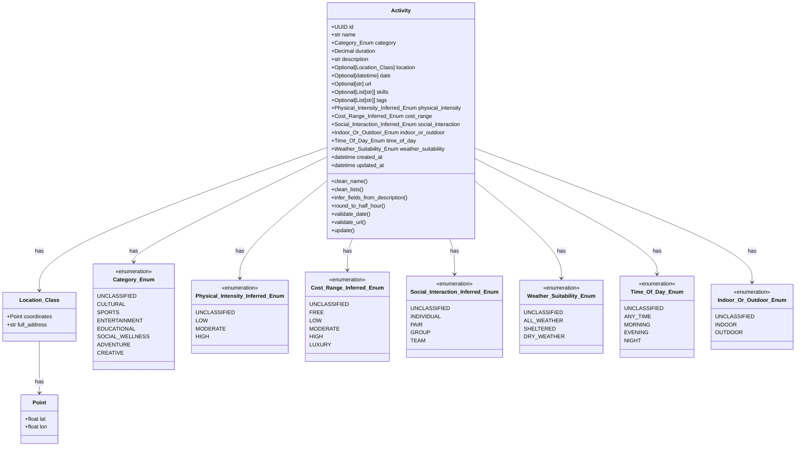

```mermaid

classDiagram
    class Activity {
    +UUID id
    +str name
    +Category_Enum category
    +Decimal duration
    +str description
    +Optional[Location_Class] location
    +Optional[datetime] date
    +Optional[str] url
    +Optional[List[str]] skills
    +Optional[List[str]] tags
    +Physical_Intensity_Inferred_Enum physical_intensity
    +Cost_Range_Inferred_Enum cost_range
    +Social_Interaction_Inferred_Enum social_interaction
    +Indoor_Or_Outdoor_Enum indoor_or_outdoor
    +Time_Of_Day_Enum time_of_day
    +Weather_Suitability_Enum weather_suitability
    +datetime created_at
    +datetime updated_at
    +clean_name()
    +clean_lists()
    +infer_fields_from_description()
    +round_to_half_hour()
    +validate_date()
    +validate_url()
    +update()
    }

    class Location_Class {
        +Point coordinates
        +str full_address
    }

    class Point {
        +float lat
        +float lon
    }

    class Category_Enum {
        <<enumeration>>
        UNCLASSIFIED
        CULTURAL
        SPORTS
        ENTERTAINMENT
        EDUCATIONAL
        SOCIAL_WELLNESS
        ADVENTURE
        CREATIVE
    }

    class Physical_Intensity_Inferred_Enum {
        <<enumeration>>
        UNCLASSIFIED
        LOW
        MODERATE
        HIGH
    }

    class Cost_Range_Inferred_Enum {
        <<enumeration>>
        UNCLASSIFIED
        FREE
        LOW
        MODERATE
        HIGH
        LUXURY
    }

    class Social_Interaction_Inferred_Enum {
        <<enumeration>>
        UNCLASSIFIED
        INDIVIDUAL
        PAIR
        GROUP
        TEAM
    }

    class Weather_Suitability_Enum {
        <<enumeration>>
        UNCLASSIFIED
        ALL_WEATHER
        SHELTERED
        DRY_WEATHER
    }

    class Time_Of_Day_Enum {
        <<enumeration>>
        UNCLASSIFIED
        ANY_TIME
        MORNING
        EVENING
        NIGHT
    }

    class Indoor_Or_Outdoor_Enum {
        <<enumeration>>
        UNCLASSIFIED
        INDOOR
        OUTDOOR
    }

    Activity --> Location_Class : has
    Location_Class --> Point : has
    Activity --> Category_Enum : has
    Activity --> Physical_Intensity_Inferred_Enum : has
    Activity --> Cost_Range_Inferred_Enum : has
    Activity --> Social_Interaction_Inferred_Enum : has
    Activity --> Weather_Suitability_Enum : has
    Activity --> Time_Of_Day_Enum : has
    Activity --> Indoor_Or_Outdoor_Enum : has
```
