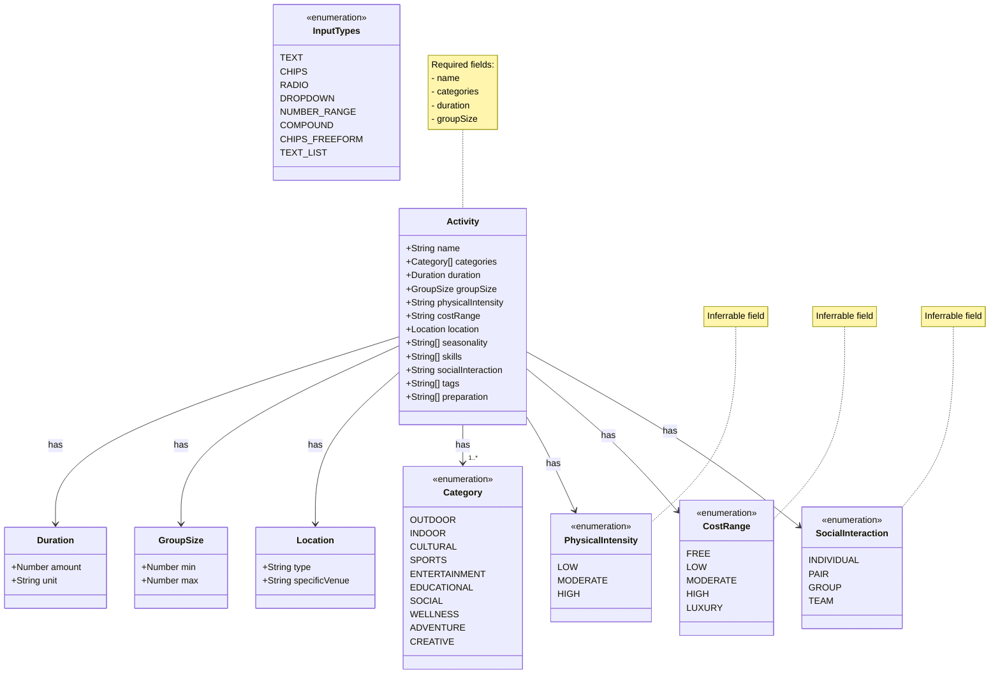

```mermaid
    classDiagram
        class Activity {
            +String name
            +Category[] categories
            +Duration duration
            +GroupSize groupSize
            +String physicalIntensity
            +String costRange
            +Location location
            +String[] seasonality
            +String[] skills
            +String socialInteraction
            +String[] tags
            +String[] preparation
        }

        class Duration {
            +Number amount
            +String unit
        }

        class GroupSize {
            +Number min
            +Number max
        }

        class Location {
            +String type
            +String specificVenue
        }

        class InputTypes {
            <<enumeration>>
            TEXT
            CHIPS
            RADIO
            DROPDOWN
            NUMBER_RANGE
            COMPOUND
            CHIPS_FREEFORM
            TEXT_LIST
        }

        class PhysicalIntensity {
            <<enumeration>>
            LOW
            MODERATE
            HIGH
        }

        class CostRange {
            <<enumeration>>
            FREE
            LOW
            MODERATE
            HIGH
            LUXURY
        }

        class SocialInteraction {
            <<enumeration>>
            INDIVIDUAL
            PAIR
            GROUP
            TEAM
        }

        class Category {
            <<enumeration>>
            OUTDOOR
            INDOOR
            CULTURAL
            SPORTS
            ENTERTAINMENT
            EDUCATIONAL
            SOCIAL
            WELLNESS
            ADVENTURE
            CREATIVE
        }

        Activity --> Duration: has
        Activity --> GroupSize: has
        Activity --> Location: has
        Activity --> "1..*" Category: has
        Activity --> PhysicalIntensity: has
        Activity --> CostRange: has
        Activity --> SocialInteraction: has

        note for Activity "Required fields:
            - name
            - categories
            - duration
            - groupSize"

        note for PhysicalIntensity "Inferrable field"
        note for CostRange "Inferrable field"
        note for SocialInteraction "Inferrable field"
```
