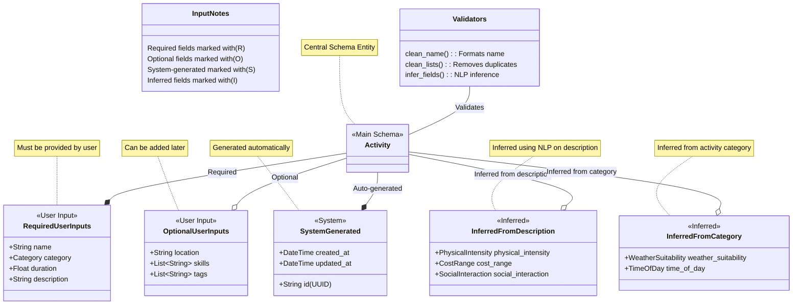

```mermaid
classDiagram
    class Activity {
        <<Main Schema>>
    }

    class RequiredUserInputs {
        <<User Input>>
        +String name
        +Category category
        +Float duration
        +String description
    }

    class OptionalUserInputs {
        <<User Input>>
        +String location
        +List~String~ skills
        +List~String~ tags
    }

    class SystemGenerated {
        <<System>>
        +String id (UUID)
        +DateTime created_at
        +DateTime updated_at
    }

    class InferredFromDescription {
        <<Inferred>>
        +PhysicalIntensity physical_intensity
        +CostRange cost_range
        +SocialInteraction social_interaction
    }

    class InferredFromCategory {
        <<Inferred>>
        +WeatherSuitability weather_suitability
        +TimeOfDay time_of_day
    }

    class InputNotes {
        Required fields marked with (R)
        Optional fields marked with (O)
        System-generated marked with (S)
        Inferred fields marked with (I)
    }

    %% Relationships
    Activity --* RequiredUserInputs : Required
    Activity --o OptionalUserInputs : Optional
    Activity --* SystemGenerated : Auto-generated
    Activity --o InferredFromDescription : Inferred from description
    Activity --o InferredFromCategory : Inferred from category

    note for Activity "Central Schema Entity"
    note for RequiredUserInputs "Must be provided by user"
    note for OptionalUserInputs "Can be added later"
    note for SystemGenerated "Generated automatically"
    note for InferredFromDescription "Inferred using NLP on description"
    note for InferredFromCategory "Inferred from activity category"

    %% Additional metadata
    class Validators {
        clean_name() : Formats name
        clean_lists() : Removes duplicates
        infer_fields() : NLP inference
    }

    Validators -- Activity : Validates
```
